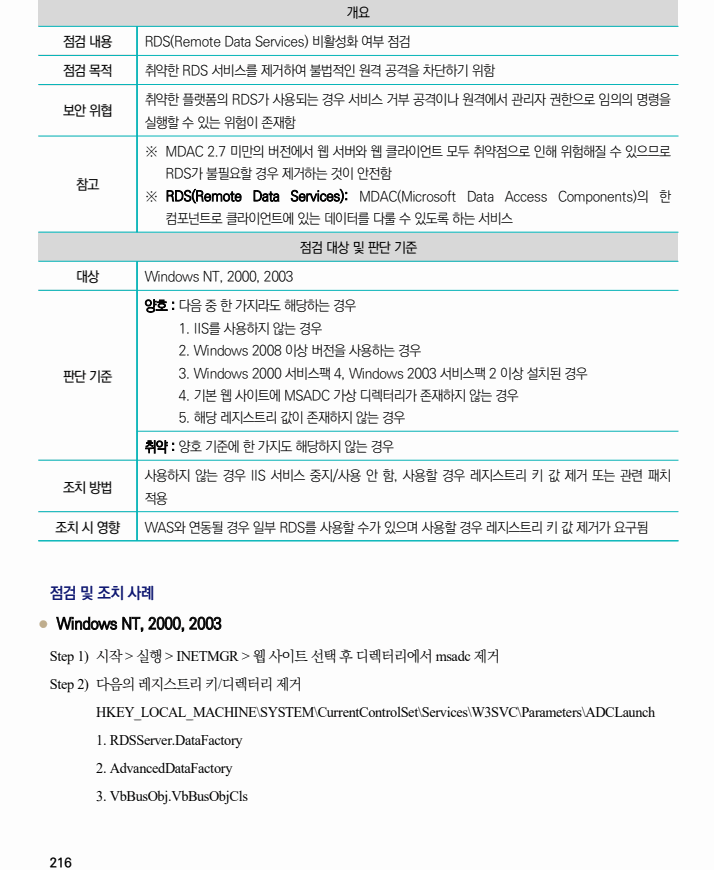

## 원문 전사

### PDF 페이지 216

~~~text transcription
개요
점검 내용 RDS(Remote Data Services) 비활성화 여부 점검
점검 목적 취약한 RDS 서비스를 제거하여 불법적인 원격 공격을 차단하기 위함
취약한 플랫폼의 RDS가 사용되는 경우 서비스 거부 공격이나 원격에서 관리자 권한으로 임의의 명령을
보안 위협
실행할 수 있는 위험이 존재함
※ MDAC 2.7 미만의 버전에서 웹 서버와 웹 클라이언트 모두 취약점으로 인해 위험해질 수 있으므로
RDS가 불필요할 경우 제거하는 것이 안전함
참고
※ RDS(Remote Data Services): MDAC(Microsoft Data Access Components)의 한
컴포넌트로 클라이언트에 있는 데이터를 다룰 수 있도록 하는 서비스
점검 대상 및 판단 기준
대상 Windows NT, 2000, 2003
양호 : 다음 중 한 가지라도 해당하는 경우
1. IIS를 사용하지 않는 경우
2. Windows 2008 이상 버전을 사용하는 경우
판단 기준 3. Windows 2000 서비스팩 4, Windows 2003 서비스팩 2 이상 설치된 경우
4. 기본 웹 사이트에 MSADC 가상 디렉터리가 존재하지 않는 경우
5. 해당 레지스트리 값이 존재하지 않는 경우
취약 : 양호 기준에 한 가지도 해당하지 않는 경우
사용하지 않는 경우 IIS 서비스 중지/사용 안 함, 사용할 경우 레지스트리 키 값 제거 또는 관련 패치
조치 방법
적용
조치 시 영향 WAS와 연동될 경우 일부 RDS를 사용할 수가 있으며 사용할 경우 레지스트리 키 값 제거가 요구됨
점검 및 조치 사례
l Windows NT, 2000, 2003
Step 1) 시작 > 실행 > INETMGR > 웹 사이트 선택 후 디렉터리에서 msadc 제거
Step 2) 다음의 레지스트리 키/디렉터리 제거
HKEY_LOCAL_MACHINE\SYSTEM\CurrentControlSet\Services\W3SVC\Parameters\ADCLaunch
1. RDSServer.DataFactory
2. AdvancedDataFactory
3. VbBusObj.VbBusObjCls
~~~

