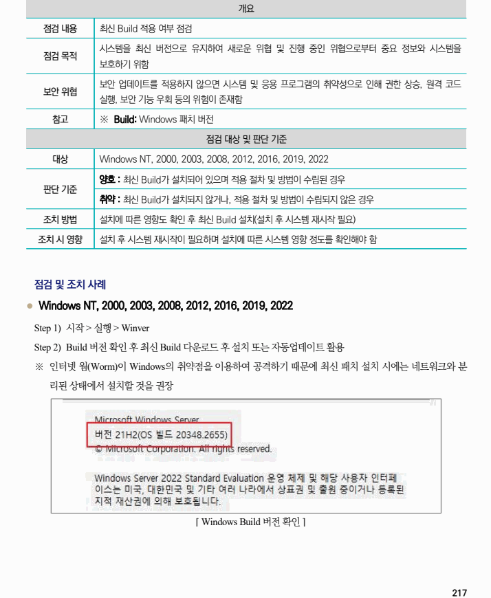

## 원문 전사

### PDF 페이지 217

~~~text transcription
개요
점검 내용 최신 Build 적용 여부 점검
시스템을 최신 버전으로 유지하여 새로운 위협 및 진행 중인 위협으로부터 중요 정보와 시스템을
점검 목적
보호하기 위함
보안 업데이트를 적용하지 않으면 시스템 및 응용 프로그램의 취약성으로 인해 권한 상승, 원격 코드
보안 위협
실행, 보안 기능 우회 등의 위험이 존재함
참고 ※ Build: Windows 패치 버전
점검 대상 및 판단 기준
대상 Windows NT, 2000, 2003, 2008, 2012, 2016, 2019, 2022
양호 : 최신 Build가 설치되어 있으며 적용 절차 및 방법이 수립된 경우
판단 기준
취약 : 최신 Build가 설치되지 않거나, 적용 절차 및 방법이 수립되지 않은 경우
조치 방법 설치에 따른 영향도 확인 후 최신 Build 설치(설치 후 시스템 재시작 필요)
조치 시 영향 설치 후 시스템 재시작이 필요하며 설치에 따른 시스템 영향 정도를 확인해야 함
점검 및 조치 사례
l Windows NT, 2000, 2003, 2008, 2012, 2016, 2019, 2022
Step 1) 시작 > 실행 > Winver
Step 2) Build 버전 확인 후 최신 Build 다운로드 후 설치 또는 자동업데이트 활용
※ 인터넷 웜(Worm)이 Windows의 취약점을 이용하여 공격하기 때문에 최신 패치 설치 시에는 네트워크와 분
리된 상태에서 설치할 것을 권장
[ Windows Build 버전 확인 ]
~~~

