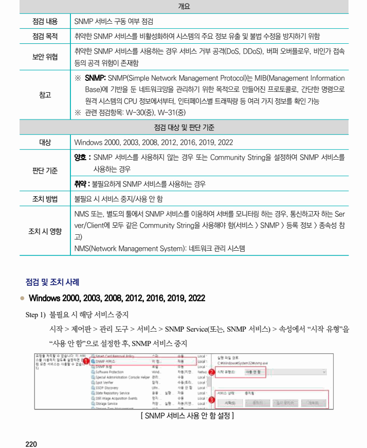

## 원문 전사

### PDF 페이지 220

~~~text transcription
개요
점검 내용 SNMP 서비스 구동 여부 점검
점검 목적 취약한 SNMP 서비스를 비활성화하여 시스템의 주요 정보 유출 및 불법 수정을 방지하기 위함
취약한 SNMP 서비스를 사용하는 경우 서비스 거부 공격(DoS, DDoS), 버퍼 오버플로우, 비인가 접속
보안 위협
등의 공격 위험이 존재함
※ SNMP: SNMP(Simple Network Management Protocol)는 MIB(Management Information
Base)에 기반을 둔 네트워크망을 관리하기 위한 목적으로 만들어진 프로토콜로, 간단한 명령으로
참고
원격 시스템의 CPU 정보에서부터, 인터페이스별 트래픽량 등 여러 가지 정보를 확인 가능
※ 관련 점검항목: W-30(중), W-31(중)
점검 대상 및 판단 기준
대상 Windows 2000, 2003, 2008, 2012, 2016, 2019, 2022
양호 : SNMP 서비스를 사용하지 않는 경우 또는 Community String을 설정하여 SNMP 서비스를
판단 기준 사용하는 경우
취약 : 불필요하게 SNMP 서비스를 사용하는 경우
조치 방법 불필요 시 서비스 중지/사용 안 함
NMS 또는, 별도의 툴에서 SNMP 서비스를 이용하여 서버를 모니터링 하는 경우, 통신하고자 하는 Ser
ver/Client에 모두 같은 Community String을 사용해야 함(서비스 > SNMP > 등록 정보 > 종속성 참
조치 시 영향
고)
NMS(Network Management System): 네트워크 관리 시스템
점검 및 조치 사례
l Windows 2000, 2003, 2008, 2012, 2016, 2019, 2022
Step 1) 불필요 시 해당 서비스 중지
시작 > 제어판 > 관리 도구 > 서비스 > SNMP Service(또는, SNMP 서비스) > 속성에서 “시작 유형”을
“사용 안 함”으로 설정한 후, SNMP 서비스 중지
[ SNMP 서비스 사용 안 함 설정 ]
~~~

