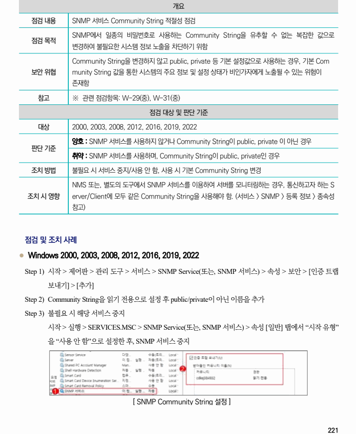

## 원문 전사

### PDF 페이지 221

~~~text transcription
개요
점검 내용 SNMP 서비스 Community String 적절성 점검
SNMP에서 일종의 비밀번호로 사용하는 Community String을 유추할 수 없는 복잡한 값으로
점검 목적
변경하여 불필요한 시스템 정보 노출을 차단하기 위함
Community String을 변경하지 않고 public, private 등 기본 설정값으로 사용하는 경우, 기본 Com
보안 위협 munity String 값을 통한 시스템의 주요 정보 및 설정 상태가 비인가자에게 노출될 수 있는 위험이
존재함
참고 ※ 관련 점검항목: W-29(중), W-31(중)
점검 대상 및 판단 기준
대상 2000, 2003, 2008, 2012, 2016, 2019, 2022
양호 : SNMP 서비스를 사용하지 않거나 Community String이 public, private 이 아닌 경우
판단 기준
취약 : SNMP 서비스를 사용하며, Community String이 public, private인 경우
조치 방법 불필요 시 서비스 중지/사용 안 함, 사용 시 기본 Community String 변경
NMS 또는, 별도의 도구에서 SNMP 서비스를 이용하여 서버를 모니터링하는 경우, 통신하고자 하는 S
조치 시 영향 erver/Client에 모두 같은 Community String을 사용해야 함. (서비스 > SNMP > 등록 정보 > 종속성
참고)
점검 및 조치 사례
l Windows 2000, 2003, 2008, 2012, 2016, 2019, 2022
Step 1) 시작 > 제어판 > 관리 도구 > 서비스 > SNMP Service(또는, SNMP 서비스) > 속성 > 보안 > [인증 트랩
보내기] > [추가]
Step 2) Community String을 읽기 전용으로 설정 후 public/private이 아닌 이름을 추가
Step 3) 불필요 시 해당 서비스 중지
시작 > 실행 > SERVICES.MSC > SNMP Service(또는, SNMP 서비스) > 속성 [일반] 탭에서 “시작 유형”
을 “사용 안 함”으로 설정한 후, SNMP 서비스 중지
[ SNMP Community String 설정 ]
~~~

