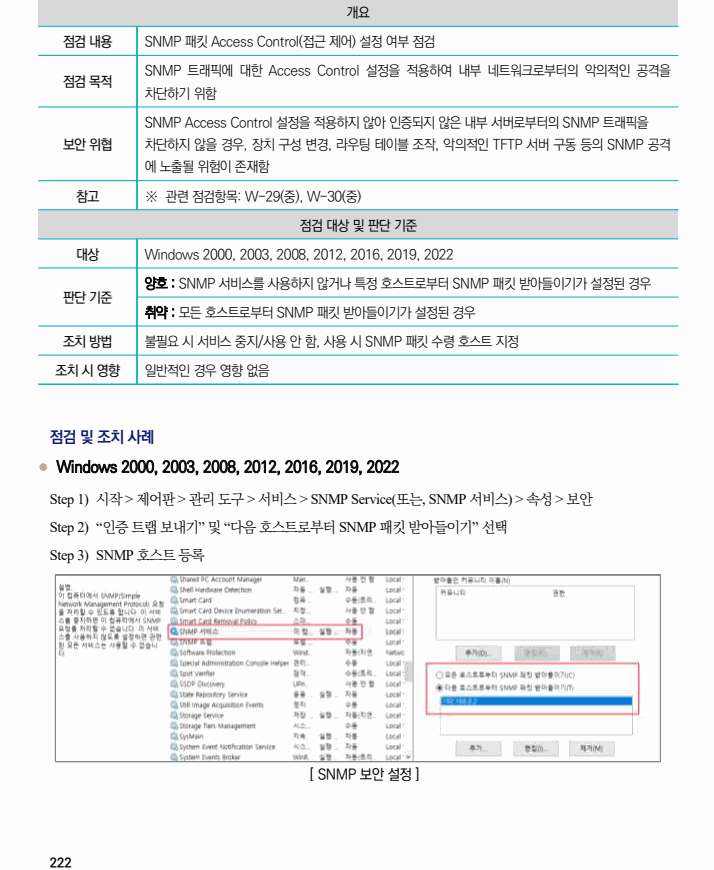

## 원문 전사

### PDF 페이지 222

~~~text transcription
개요
점검 내용 SNMP 패킷 Access Control(접근 제어) 설정 여부 점검
SNMP 트래픽에 대한 Access Control 설정을 적용하여 내부 네트워크로부터의 악의적인 공격을
점검 목적
차단하기 위함
SNMP Access Control 설정을 적용하지 않아 인증되지 않은 내부 서버로부터의 SNMP 트래픽을
보안 위협 차단하지 않을 경우, 장치 구성 변경, 라우팅 테이블 조작, 악의적인 TFTP 서버 구동 등의 SNMP 공격
에 노출될 위험이 존재함
참고 ※ 관련 점검항목: W-29(중), W-30(중)
점검 대상 및 판단 기준
대상 Windows 2000, 2003, 2008, 2012, 2016, 2019, 2022
양호 : SNMP 서비스를 사용하지 않거나 특정 호스트로부터 SNMP 패킷 받아들이기가 설정된 경우
판단 기준
취약 : 모든 호스트로부터 SNMP 패킷 받아들이기가 설정된 경우
조치 방법 불필요 시 서비스 중지/사용 안 함, 사용 시 SNMP 패킷 수령 호스트 지정
조치 시 영향 일반적인 경우 영향 없음
점검 및 조치 사례
l Windows 2000, 2003, 2008, 2012, 2016, 2019, 2022
Step 1) 시작 > 제어판 > 관리 도구 > 서비스 > SNMP Service(또는, SNMP 서비스) > 속성 > 보안
Step 2) “인증 트랩 보내기” 및 “다음 호스트로부터 SNMP 패킷 받아들이기” 선택
Step 3) SNMP 호스트 등록
[ SNMP 보안 설정 ]
~~~

