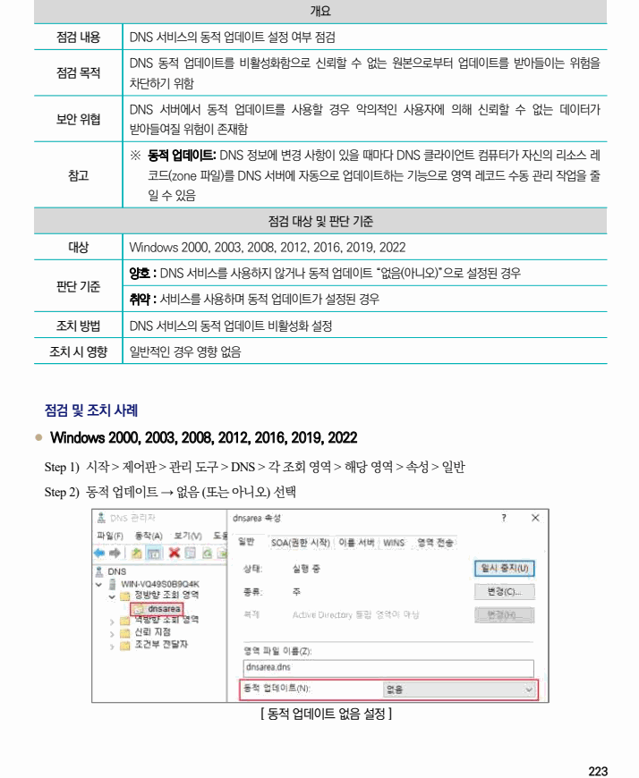
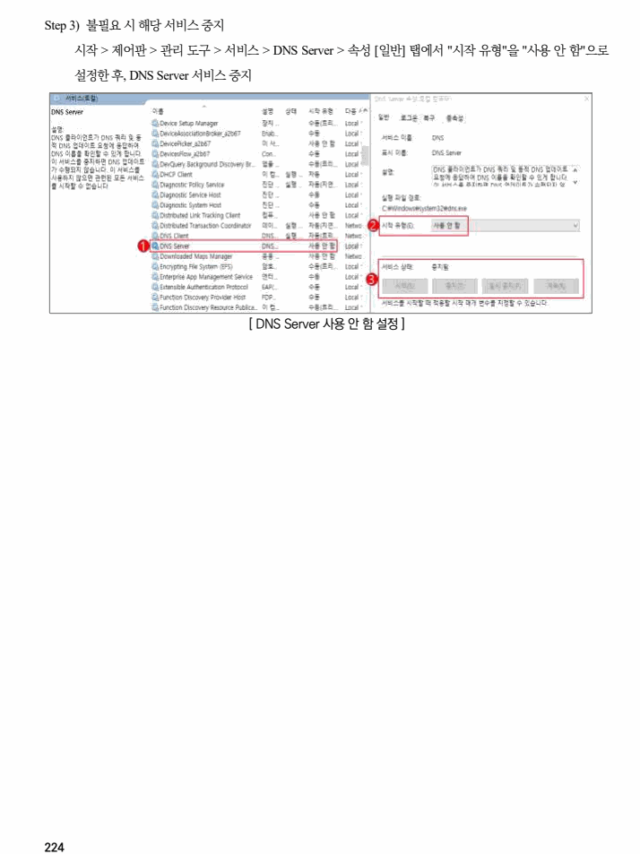

## 원문 전사

### PDF 페이지 223

~~~text transcription
개요
점검 내용 DNS 서비스의 동적 업데이트 설정 여부 점검
DNS 동적 업데이트를 비활성화함으로 신뢰할 수 없는 원본으로부터 업데이트를 받아들이는 위험을
점검 목적
차단하기 위함
DNS 서버에서 동적 업데이트를 사용할 경우 악의적인 사용자에 의해 신뢰할 수 없는 데이터가
보안 위협
받아들여질 위험이 존재함
※ 동적 업데이트: DNS 정보에 변경 사항이 있을 때마다 DNS 클라이언트 컴퓨터가 자신의 리소스 레
참고 코드(zone 파일)를 DNS 서버에 자동으로 업데이트하는 기능으로 영역 레코드 수동 관리 작업을 줄
일 수 있음
점검 대상 및 판단 기준
대상 Windows 2000, 2003, 2008, 2012, 2016, 2019, 2022
양호 : DNS 서비스를 사용하지 않거나 동적 업데이트 “없음(아니오)”으로 설정된 경우
판단 기준
취약 : 서비스를 사용하며 동적 업데이트가 설정된 경우
조치 방법 DNS 서비스의 동적 업데이트 비활성화 설정
조치 시 영향 일반적인 경우 영향 없음
점검 및 조치 사례
l Windows 2000, 2003, 2008, 2012, 2016, 2019, 2022
Step 1) 시작 > 제어판 > 관리 도구 > DNS > 각 조회 영역 > 해당 영역 > 속성 > 일반
Step 2) 동적 업데이트 → 없음 (또는 아니오) 선택
[ 동적 업데이트 없음 설정 ]
~~~

### PDF 페이지 224

~~~text transcription
Step 3) 불필요 시 해당 서비스 중지
시작 > 제어판 > 관리 도구 > 서비스 > DNS Server > 속성 [일반] 탭에서 "시작 유형"을 "사용 안 함"으로
설정한 후, DNS Server 서비스 중지
[ DNS Server 사용 안 함 설정 ]
~~~

