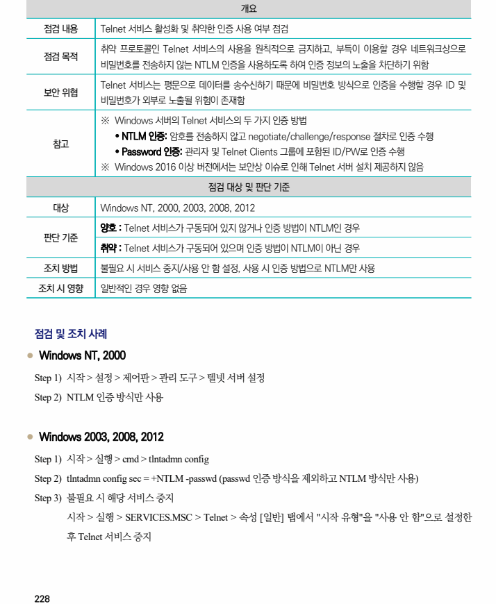

## 원문 전사

### PDF 페이지 228

~~~text transcription
개요
점검 내용 Telnet 서비스 활성화 및 취약한 인증 사용 여부 점검
취약 프로토콜인 Telnet 서비스의 사용을 원칙적으로 금지하고, 부득이 이용할 경우 네트워크상으로
점검 목적
비밀번호를 전송하지 않는 NTLM 인증을 사용하도록 하여 인증 정보의 노출을 차단하기 위함
Telnet 서비스는 평문으로 데이터를 송수신하기 때문에 비밀번호 방식으로 인증을 수행할 경우 ID 및
보안 위협
비밀번호가 외부로 노출될 위험이 존재함
※ Windows 서버의 Telnet 서비스의 두 가지 인증 방법
Ÿ NTLM 인증: 암호를 전송하지 않고 negotiate/challenge/response 절차로 인증 수행
참고
Ÿ Password 인증: 관리자 및 Telnet Clients 그룹에 포함된 ID/PW로 인증 수행
※ Windows 2016 이상 버전에서는 보안상 이슈로 인해 Telnet 서버 설치 제공하지 않음
점검 대상 및 판단 기준
대상 Windows NT, 2000, 2003, 2008, 2012
양호 : Telnet 서비스가 구동되어 있지 않거나 인증 방법이 NTLM인 경우
판단 기준
취약 : Telnet 서비스가 구동되어 있으며 인증 방법이 NTLM이 아닌 경우
조치 방법 불필요 시 서비스 중지/사용 안 함 설정, 사용 시 인증 방법으로 NTLM만 사용
조치 시 영향 일반적인 경우 영향 없음
점검 및 조치 사례
l Windows NT, 2000
Step 1) 시작 > 설정 > 제어판 > 관리 도구 > 텔넷 서버 설정
Step 2) NTLM 인증 방식만 사용
l Windows 2003, 2008, 2012
Step 1) 시작 > 실행 > cmd > tlntadmn config
Step 2) tlntadmn config sec = +NTLM -passwd (passwd 인증 방식을 제외하고 NTLM 방식만 사용)
Step 3) 불필요 시 해당 서비스 중지
시작 > 실행 > SERVICES.MSC > Telnet > 속성 [일반] 탭에서 "시작 유형"을 "사용 안 함"으로 설정한
후 Telnet 서비스 중지
~~~

