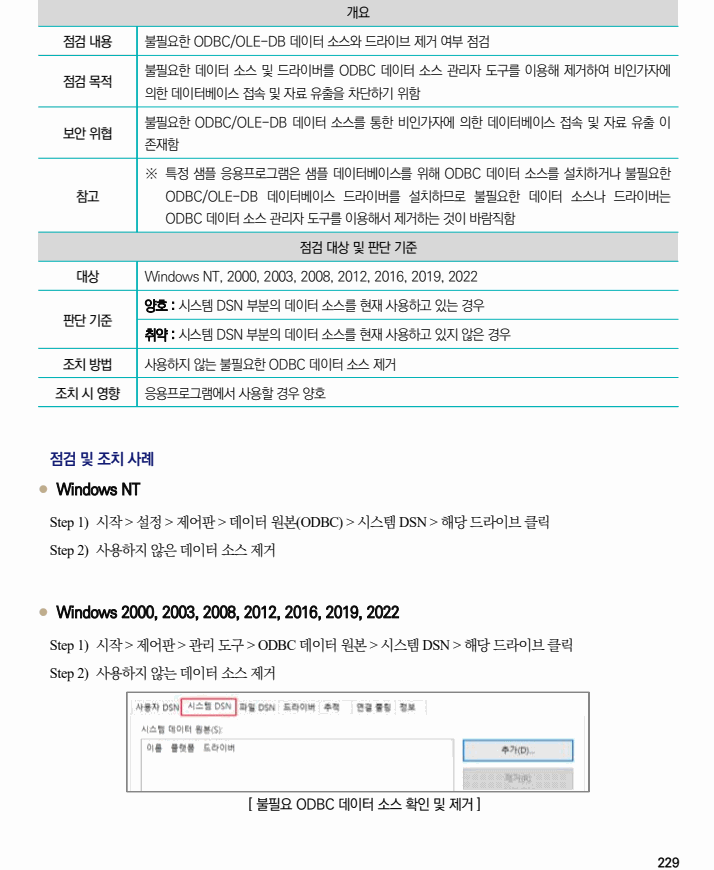

## 원문 전사

### PDF 페이지 229

~~~text transcription
개요
점검 내용 불필요한 ODBC/OLE-DB 데이터 소스와 드라이브 제거 여부 점검
불필요한 데이터 소스 및 드라이버를 ODBC 데이터 소스 관리자 도구를 이용해 제거하여 비인가자에
점검 목적
의한 데이터베이스 접속 및 자료 유출을 차단하기 위함
불필요한 ODBC/OLE-DB 데이터 소스를 통한 비인가자에 의한 데이터베이스 접속 및 자료 유출 이
보안 위협
존재함
※ 특정 샘플 응용프로그램은 샘플 데이터베이스를 위해 ODBC 데이터 소스를 설치하거나 불필요한
참고 ODBC/OLE-DB 데이터베이스 드라이버를 설치하므로 불필요한 데이터 소스나 드라이버는
ODBC 데이터 소스 관리자 도구를 이용해서 제거하는 것이 바람직함
점검 대상 및 판단 기준
대상 Windows NT, 2000, 2003, 2008, 2012, 2016, 2019, 2022
양호 : 시스템 DSN 부분의 데이터 소스를 현재 사용하고 있는 경우
판단 기준
취약 : 시스템 DSN 부분의 데이터 소스를 현재 사용하고 있지 않은 경우
조치 방법 사용하지 않는 불필요한 ODBC 데이터 소스 제거
조치 시 영향 응용프로그램에서 사용할 경우 양호
점검 및 조치 사례
l Windows NT
Step 1) 시작 > 설정 > 제어판 > 데이터 원본(ODBC) > 시스템 DSN > 해당 드라이브 클릭
Step 2) 사용하지 않은 데이터 소스 제거
l Windows 2000, 2003, 2008, 2012, 2016, 2019, 2022
Step 1) 시작 > 제어판 > 관리 도구 > ODBC 데이터 원본 > 시스템 DSN > 해당 드라이브 클릭
Step 2) 사용하지 않는 데이터 소스 제거
[ 불필요 ODBC 데이터 소스 확인 및 제거 ]
~~~

