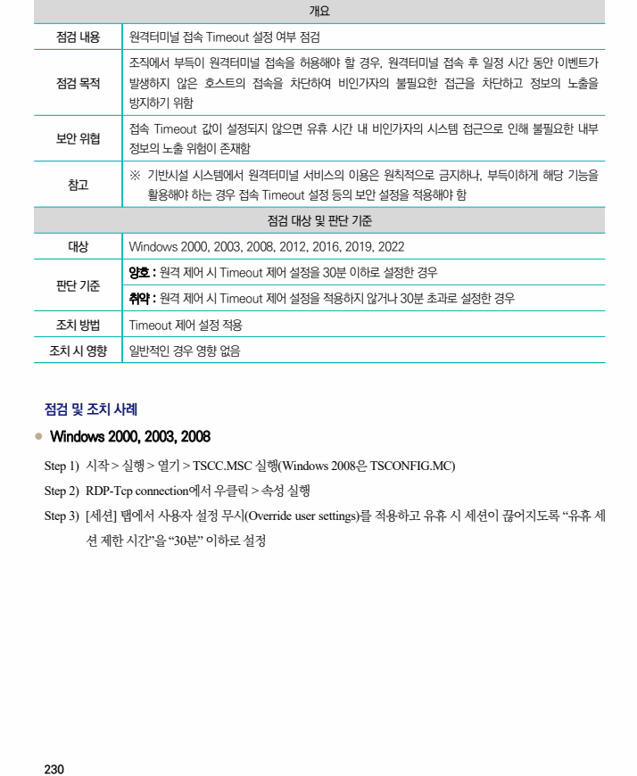
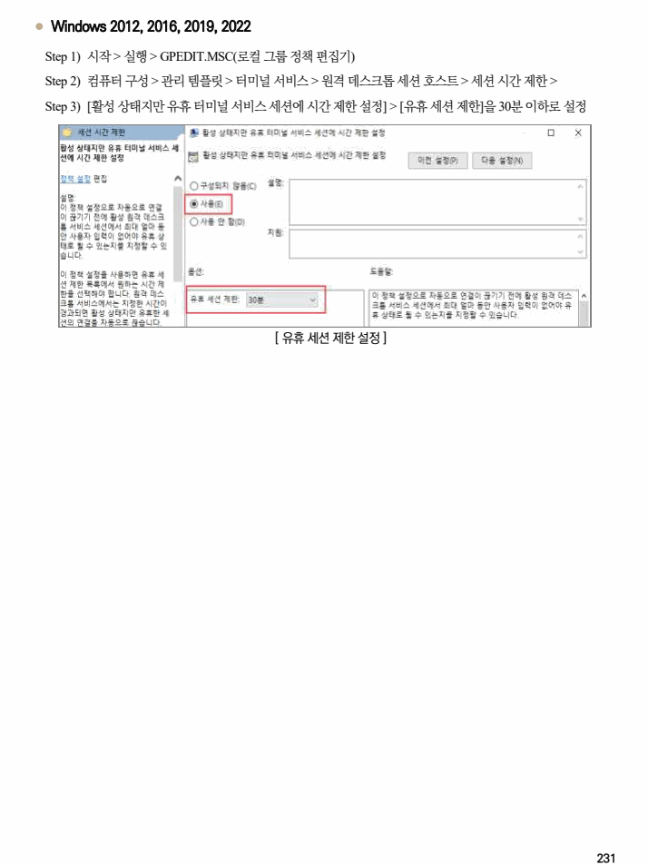

## 원문 전사

### PDF 페이지 230

~~~text transcription
개요
점검 내용 원격터미널 접속 Timeout 설정 여부 점검
조직에서 부득이 원격터미널 접속을 허용해야 할 경우, 원격터미널 접속 후 일정 시간 동안 이벤트가
점검 목적 발생하지 않은 호스트의 접속을 차단하여 비인가자의 불필요한 접근을 차단하고 정보의 노출을
방지하기 위함
접속 Timeout 값이 설정되지 않으면 유휴 시간 내 비인가자의 시스템 접근으로 인해 불필요한 내부
보안 위협
정보의 노출 위험이 존재함
※ 기반시설 시스템에서 원격터미널 서비스의 이용은 원칙적으로 금지하나, 부득이하게 해당 기능을
참고
활용해야 하는 경우 접속 Timeout 설정 등의 보안 설정을 적용해야 함
점검 대상 및 판단 기준
대상 Windows 2000, 2003, 2008, 2012, 2016, 2019, 2022
양호 : 원격 제어 시 Timeout 제어 설정을 30분 이하로 설정한 경우
판단 기준
취약 : 원격 제어 시 Timeout 제어 설정을 적용하지 않거나 30분 초과로 설정한 경우
조치 방법 Timeout 제어 설정 적용
조치 시 영향 일반적인 경우 영향 없음
점검 및 조치 사례
l Windows 2000, 2003, 2008
Step 1) 시작 > 실행 > 열기 > TSCC.MSC 실행(Windows 2008은 TSCONFIG.MC)
Step 2) RDP-Tcp connection에서 우클릭 > 속성 실행
Step 3) [세션] 탭에서 사용자 설정 무시(Override user settings)를 적용하고 유휴 시 세션이 끊어지도록 “유휴 세
션 제한 시간”을 “30분” 이하로 설정
~~~

### PDF 페이지 231

~~~text transcription
l Windows 2012, 2016, 2019, 2022
Step 1) 시작 > 실행 > GPEDIT.MSC(로컬 그룹 정책 편집기)
Step 2) 컴퓨터 구성 > 관리 템플릿 > 터미널 서비스 > 원격 데스크톱 세션 호스트 > 세션 시간 제한 >
Step 3) [활성 상태지만 유휴 터미널 서비스 세션에 시간 제한 설정] > [유휴 세션 제한]을 30분 이하로 설정
[ 유휴 세션 제한 설정 ]
~~~

