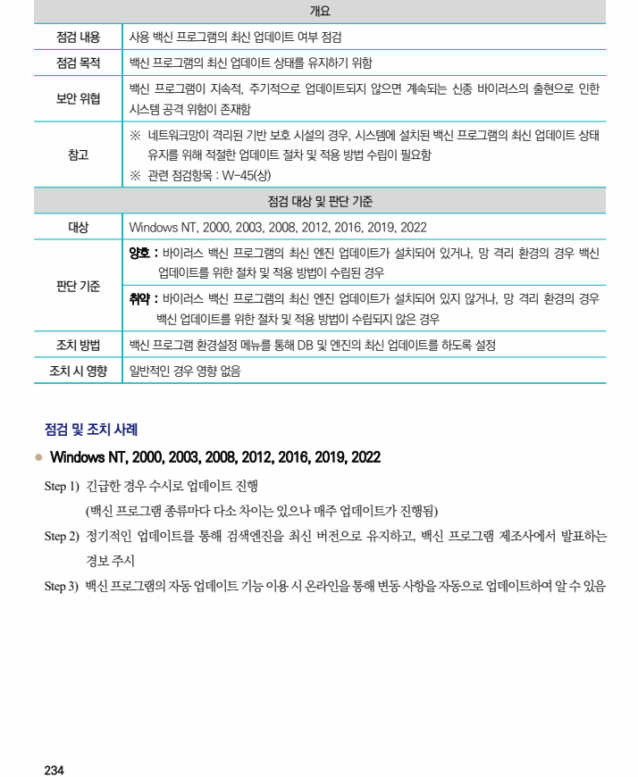

## 원문 전사

### PDF 페이지 234

~~~text transcription
개요
점검 내용 사용 백신 프로그램의 최신 업데이트 여부 점검
점검 목적 백신 프로그램의 최신 업데이트 상태를 유지하기 위함
백신 프로그램이 지속적, 주기적으로 업데이트되지 않으면 계속되는 신종 바이러스의 출현으로 인한
보안 위협
시스템 공격 위험이 존재함
※ 네트워크망이 격리된 기반 보호 시설의 경우, 시스템에 설치된 백신 프로그램의 최신 업데이트 상태
참고 유지를 위해 적절한 업데이트 절차 및 적용 방법 수립이 필요함
※ 관련 점검항목 : W-45(상)
점검 대상 및 판단 기준
대상 Windows NT, 2000, 2003, 2008, 2012, 2016, 2019, 2022
양호 : 바이러스 백신 프로그램의 최신 엔진 업데이트가 설치되어 있거나, 망 격리 환경의 경우 백신
업데이트를 위한 절차 및 적용 방법이 수립된 경우
판단 기준
취약 : 바이러스 백신 프로그램의 최신 엔진 업데이트가 설치되어 있지 않거나, 망 격리 환경의 경우
백신 업데이트를 위한 절차 및 적용 방법이 수립되지 않은 경우
조치 방법 백신 프로그램 환경설정 메뉴를 통해 DB 및 엔진의 최신 업데이트를 하도록 설정
조치 시 영향 일반적인 경우 영향 없음
점검 및 조치 사례
l Windows NT, 2000, 2003, 2008, 2012, 2016, 2019, 2022
Step 1) 긴급한 경우 수시로 업데이트 진행
(백신 프로그램 종류마다 다소 차이는 있으나 매주 업데이트가 진행됨)
Step 2) 정기적인 업데이트를 통해 검색엔진을 최신 버전으로 유지하고, 백신 프로그램 제조사에서 발표하는
경보 주시
Step 3) 백신 프로그램의 자동 업데이트 기능 이용 시 온라인을 통해 변동 사항을 자동으로 업데이트하여 알 수 있음
~~~

