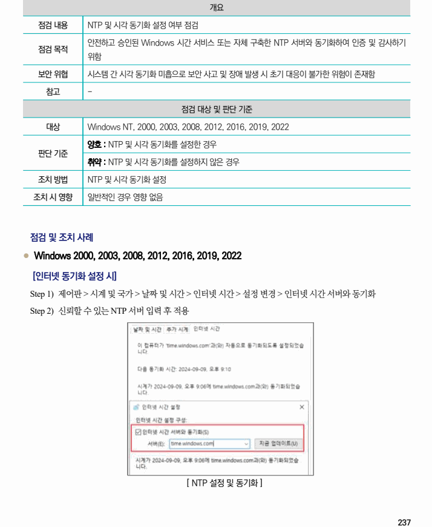
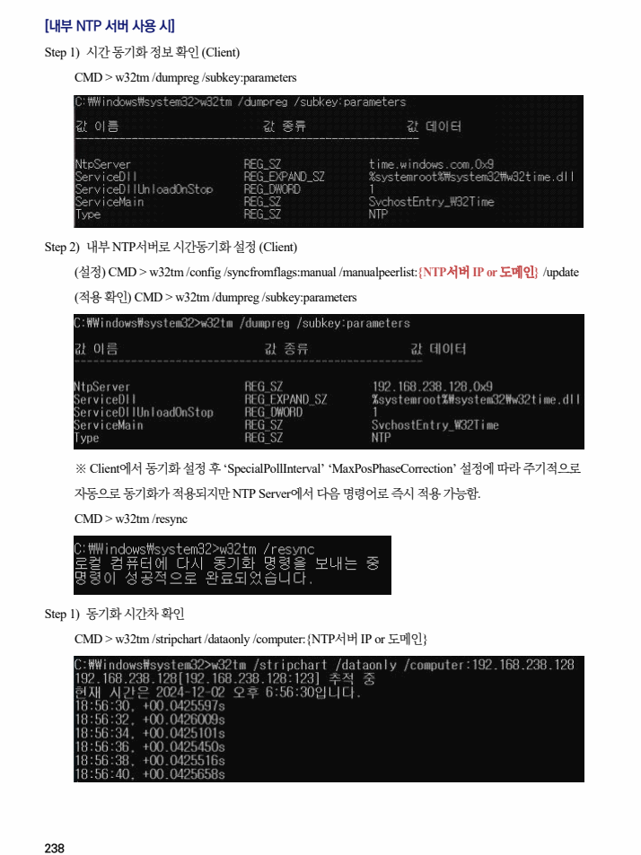

## 원문 전사

### PDF 페이지 237

~~~text transcription
개요
점검 내용 NTP 및 시각 동기화 설정 여부 점검
안전하고 승인된 Windows 시간 서비스 또는 자체 구축한 NTP 서버와 동기화하여 인증 및 감사하기
점검 목적
위함
보안 위협 시스템 간 시각 동기화 미흡으로 보안 사고 및 장애 발생 시 초기 대응이 불가한 위험이 존재함
참고 -
점검 대상 및 판단 기준
대상 Windows NT, 2000, 2003, 2008, 2012, 2016, 2019, 2022
양호 : NTP 및 시각 동기화를 설정한 경우
판단 기준
취약 : NTP 및 시각 동기화를 설정하지 않은 경우
조치 방법 NTP 및 시각 동기화 설정
조치 시 영향 일반적인 경우 영향 없음
점검 및 조치 사례
l Windows 2000, 2003, 2008, 2012, 2016, 2019, 2022
[인터넷 동기화 설정 시]
Step 1) 제어판 > 시계 및 국가 > 날짜 및 시간 > 인터넷 시간 > 설정 변경 > 인터넷 시간 서버와 동기화
Step 2) 신뢰할 수 있는 NTP 서버 입력 후 적용
[ NTP 설정 및 동기화 ]
~~~

### PDF 페이지 238

~~~text transcription
[내부 NTP 서버 사용 시]
Step 1) 시간 동기화 정보 확인 (Client)
CMD > w32tm /dumpreg /subkey:parameters
Step 2) 내부 NTP서버로 시간동기화 설정 (Client)
(설정) CMD > w32tm /config /syncfromflags:manual /manualpeerlist:{NTP서버 IP or 도메인} /update
(적용 확인) CMD > w32tm /dumpreg /subkey:parameters
※ Client에서 동기화 설정 후 ‘SpecialPollInterval’ ‘MaxPosPhaseCorrection’ 설정에 따라 주기적으로
자동으로 동기화가 적용되지만 NTP Server에서 다음 명령어로 즉시 적용 가능함.
CMD > w32tm /resync
Step 1) 동기화 시간차 확인
CMD > w32tm /stripchart /dataonly /computer:{NTP서버 IP or 도메인}
~~~

