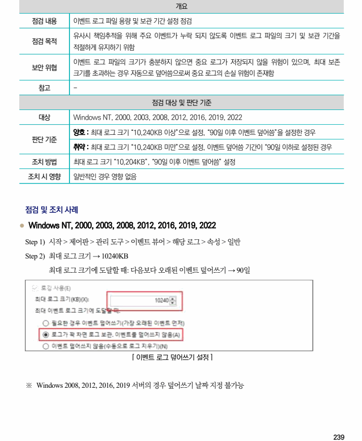

## 원문 전사

### PDF 페이지 239

~~~text transcription
개요
점검 내용 이벤트 로그 파일 용량 및 보관 기간 설정 점검
유사시 책임추적을 위해 주요 이벤트가 누락 되지 않도록 이벤트 로그 파일의 크기 및 보관 기간을
점검 목적
적절하게 유지하기 위함
이벤트 로그 파일의 크기가 충분하지 않으면 중요 로그가 저장되지 않을 위험이 있으며, 최대 보존
보안 위협
크기를 초과하는 경우 자동으로 덮어씀으로써 중요 로그의 손실 위험이 존재함
참고 -
점검 대상 및 판단 기준
대상 Windows NT, 2000, 2003, 2008, 2012, 2016, 2019, 2022
양호 : 최대 로그 크기 “10,240KB 이상”으로 설정, “90일 이후 이벤트 덮어씀”을 설정한 경우
판단 기준
취약 : 최대 로그 크기 “10,240KB 미만”으로 설정, 이벤트 덮어씀 기간이 “90일 이하로 설정된 경우
조치 방법 최대 로그 크기 “10,204KB”, “90일 이후 이벤트 덮어씀” 설정
조치 시 영향 일반적인 경우 영향 없음
점검 및 조치 사례
l Windows NT, 2000, 2003, 2008, 2012, 2016, 2019, 2022
Step 1) 시작 > 제어판 > 관리 도구 > 이벤트 뷰어 > 해당 로그 > 속성 > 일반
Step 2) 최대 로그 크기 → 10240KB
최대 로그 크기에 도달할 때: 다음보다 오래된 이벤트 덮어쓰기 → 90일
[ 이벤트 로그 덮어쓰기 설정 ]
※ Windows 2008, 2012, 2016, 2019 서버의 경우 덮어쓰기 날짜 지정 불가능
~~~

