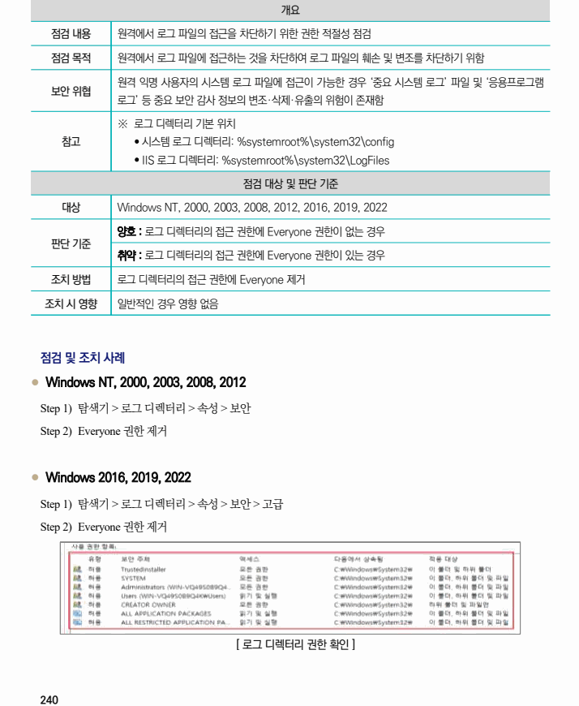

## 원문 전사

### PDF 페이지 240

~~~text transcription
개요
점검 내용 원격에서 로그 파일의 접근을 차단하기 위한 권한 적절성 점검
점검 목적 원격에서 로그 파일에 접근하는 것을 차단하여 로그 파일의 훼손 및 변조를 차단하기 위함
원격 익명 사용자의 시스템 로그 파일에 접근이 가능한 경우 ‘중요 시스템 로그’ 파일 및 ‘응용프로그램
보안 위협
로그’ 등 중요 보안 감사 정보의 변조·삭제·유출의 위험이 존재함
※ 로그 디렉터리 기본 위치
참고 Ÿ 시스템 로그 디렉터리: %systemroot%\system32\config
Ÿ IIS 로그 디렉터리: %systemroot%\system32\LogFiles
점검 대상 및 판단 기준
대상 Windows NT, 2000, 2003, 2008, 2012, 2016, 2019, 2022
양호 : 로그 디렉터리의 접근 권한에 Everyone 권한이 없는 경우
판단 기준
취약 : 로그 디렉터리의 접근 권한에 Everyone 권한이 있는 경우
조치 방법 로그 디렉터리의 접근 권한에 Everyone 제거
조치 시 영향 일반적인 경우 영향 없음
점검 및 조치 사례
l Windows NT, 2000, 2003, 2008, 2012
Step 1) 탐색기 > 로그 디렉터리 > 속성 > 보안
Step 2) Everyone 권한 제거
l Windows 2016, 2019, 2022
Step 1) 탐색기 > 로그 디렉터리 > 속성 > 보안 > 고급
Step 2) Everyone 권한 제거
[ 로그 디렉터리 권한 확인 ]
~~~

