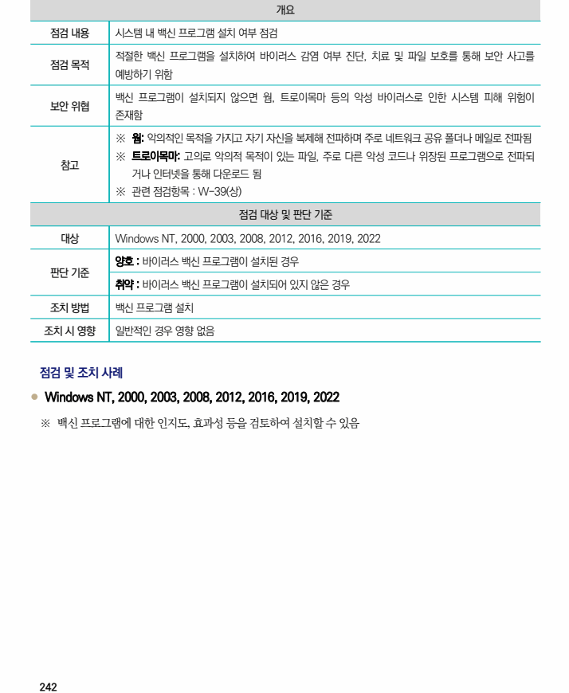

## 원문 전사

### PDF 페이지 242

~~~text transcription
개요
점검 내용 시스템 내 백신 프로그램 설치 여부 점검
적절한 백신 프로그램을 설치하여 바이러스 감염 여부 진단, 치료 및 파일 보호를 통해 보안 사고를
점검 목적
예방하기 위함
백신 프로그램이 설치되지 않으면 웜, 트로이목마 등의 악성 바이러스로 인한 시스템 피해 위험이
보안 위협
존재함
※ 웜: 악의적인 목적을 가지고 자기 자신을 복제해 전파하며 주로 네트워크 공유 폴더나 메일로 전파됨
※ 트로이목마: 고의로 악의적 목적이 있는 파일, 주로 다른 악성 코드나 위장된 프로그램으로 전파되
참고
거나 인터넷을 통해 다운로드 됨
※ 관련 점검항목 : W-39(상)
점검 대상 및 판단 기준
대상 Windows NT, 2000, 2003, 2008, 2012, 2016, 2019, 2022
양호 : 바이러스 백신 프로그램이 설치된 경우
판단 기준
취약 : 바이러스 백신 프로그램이 설치되어 있지 않은 경우
조치 방법 백신 프로그램 설치
조치 시 영향 일반적인 경우 영향 없음
점검 및 조치 사례
l Windows NT, 2000, 2003, 2008, 2012, 2016, 2019, 2022
※ 백신 프로그램에 대한 인지도, 효과성 등을 검토하여 설치할 수 있음
~~~

