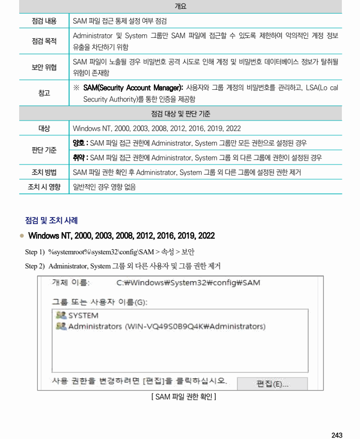

## 원문 전사

### PDF 페이지 243

~~~text transcription
개요
점검 내용 SAM 파일 접근 통제 설정 여부 점검
Administrator 및 System 그룹만 SAM 파일에 접근할 수 있도록 제한하여 악의적인 계정 정보
점검 목적
유출을 차단하기 위함
SAM 파일이 노출될 경우 비밀번호 공격 시도로 인해 계정 및 비밀번호 데이터베이스 정보가 탈취될
보안 위협
위험이 존재함
※ SAM(Security Account Manager): 사용자와 그룹 계정의 비밀번호를 관리하고, LSA(Lo cal
참고
Security Authority)를 통한 인증을 제공함
점검 대상 및 판단 기준
대상 Windows NT, 2000, 2003, 2008, 2012, 2016, 2019, 2022
양호 : SAM 파일 접근 권한에 Administrator, System 그룹만 모든 권한으로 설정된 경우
판단 기준
취약 : SAM 파일 접근 권한에 Administrator, System 그룹 외 다른 그룹에 권한이 설정된 경우
조치 방법 SAM 파일 권한 확인 후 Administrator, System 그룹 외 다른 그룹에 설정된 권한 제거
조치 시 영향 일반적인 경우 영향 없음
점검 및 조치 사례
l Windows NT, 2000, 2003, 2008, 2012, 2016, 2019, 2022
Step 1) %systemroot%\system32\config\SAM > 속성 > 보안
Step 2) Administrator, System 그룹 외 다른 사용자 및 그룹 권한 제거
[ SAM 파일 권한 확인 ]
~~~

