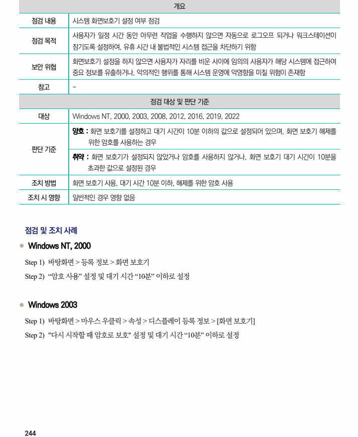
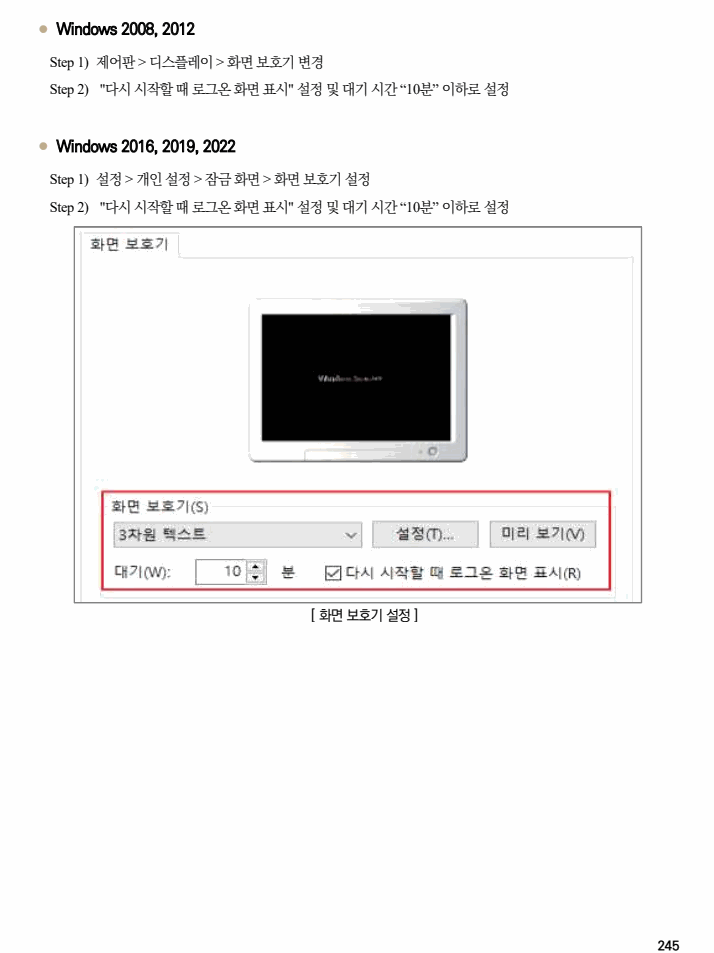

## 원문 전사

### PDF 페이지 244

~~~text transcription
개요
점검 내용 시스템 화면보호기 설정 여부 점검
사용자가 일정 시간 동안 아무런 작업을 수행하지 않으면 자동으로 로그오프 되거나 워크스테이션이
점검 목적
잠기도록 설정하여, 유휴 시간 내 불법적인 시스템 접근을 차단하기 위함
화면보호기 설정을 하지 않으면 사용자가 자리를 비운 사이에 임의의 사용자가 해당 시스템에 접근하여
보안 위협
중요 정보를 유출하거나, 악의적인 행위를 통해 시스템 운영에 악영향을 미칠 위험이 존재함
참고 -
점검 대상 및 판단 기준
대상 Windows NT, 2000, 2003, 2008, 2012, 2016, 2019, 2022
양호 : 화면 보호기를 설정하고 대기 시간이 10분 이하의 값으로 설정되어 있으며, 화면 보호기 해제를
위한 암호를 사용하는 경우
판단 기준
취약 : 화면 보호기가 설정되지 않았거나 암호를 사용하지 않거나, 화면 보호기 대기 시간이 10분을
초과한 값으로 설정된 경우
조치 방법 화면 보호기 사용, 대기 시간 10분 이하, 해제를 위한 암호 사용
조치 시 영향 일반적인 경우 영향 없음
점검 및 조치 사례
l Windows NT, 2000
Step 1) 바탕화면 > 등록 정보 > 화면 보호기
Step 2) “암호 사용” 설정 및 대기 시간 “10분” 이하로 설정
l Windows 2003
Step 1) 바탕화면 > 마우스 우클릭 > 속성 > 디스플레이 등록 정보 > [화면 보호기]
Step 2) "다시 시작할 때 암호로 보호" 설정 및 대기 시간 “10분” 이하로 설정
~~~

### PDF 페이지 245

~~~text transcription
l Windows 2008, 2012
Step 1) 제어판 > 디스플레이 > 화면 보호기 변경
Step 2) "다시 시작할 때 로그온 화면 표시" 설정 및 대기 시간 “10분” 이하로 설정
l Windows 2016, 2019, 2022
Step 1) 설정 > 개인 설정 > 잠금 화면 > 화면 보호기 설정
Step 2) "다시 시작할 때 로그온 화면 표시" 설정 및 대기 시간 “10분” 이하로 설정
[ 화면 보호기 설정 ]
~~~

