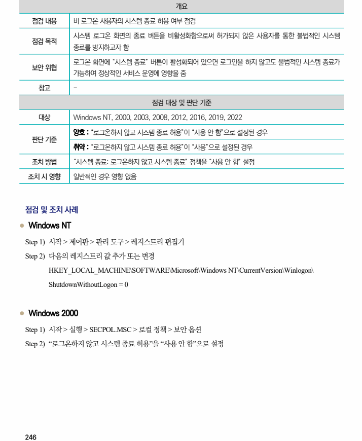
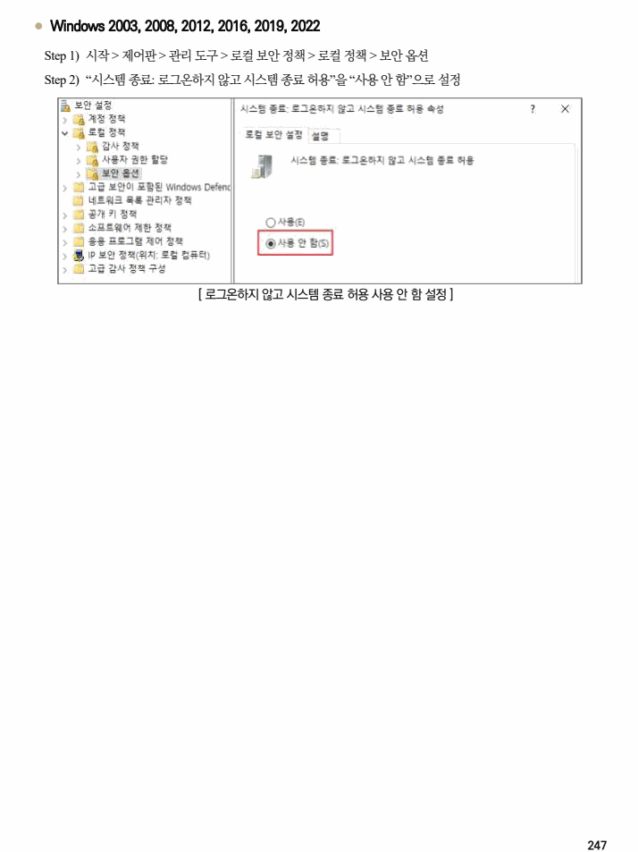

## 원문 전사

### PDF 페이지 246

~~~text transcription
개요
점검 내용 비 로그온 사용자의 시스템 종료 허용 여부 점검
시스템 로그온 화면의 종료 버튼을 비활성화함으로써 허가되지 않은 사용자를 통한 불법적인 시스템
점검 목적
종료를 방지하고자 함
로그온 화면에 “시스템 종료” 버튼이 활성화되어 있으면 로그인을 하지 않고도 불법적인 시스템 종료가
보안 위협
가능하여 정상적인 서비스 운영에 영향을 줌
참고 -
점검 대상 및 판단 기준
대상 Windows NT, 2000, 2003, 2008, 2012, 2016, 2019, 2022
양호 : “로그온하지 않고 시스템 종료 허용”이 “사용 안 함”으로 설정된 경우
판단 기준
취약 : “로그온하지 않고 시스템 종료 허용”이 “사용”으로 설정된 경우
조치 방법 “시스템 종료: 로그온하지 않고 시스템 종료” 정책을 “사용 안 함” 설정
조치 시 영향 일반적인 경우 영향 없음
점검 및 조치 사례
l Windows NT
Step 1) 시작 > 제어판 > 관리 도구 > 레지스트리 편집기
Step 2) 다음의 레지스트리 값 추가 또는 변경
HKEY_LOCAL_MACHINE\SOFTWARE\Microsoft\Windows NT\CurrentVersion\Winlogon\
ShutdownWithoutLogon = 0
l Windows 2000
Step 1) 시작 > 실행 > SECPOL.MSC > 로컬 정책 > 보안 옵션
Step 2) “로그온하지 않고 시스템 종료 허용”을 “사용 안 함”으로 설정
~~~

### PDF 페이지 247

~~~text transcription
l Windows 2003, 2008, 2012, 2016, 2019, 2022
Step 1) 시작 > 제어판 > 관리 도구 > 로컬 보안 정책 > 로컬 정책 > 보안 옵션
Step 2) “시스템 종료: 로그온하지 않고 시스템 종료 허용”을 “사용 안 함”으로 설정
[ 로그온하지 않고 시스템 종료 허용 사용 안 함 설정 ]
~~~

