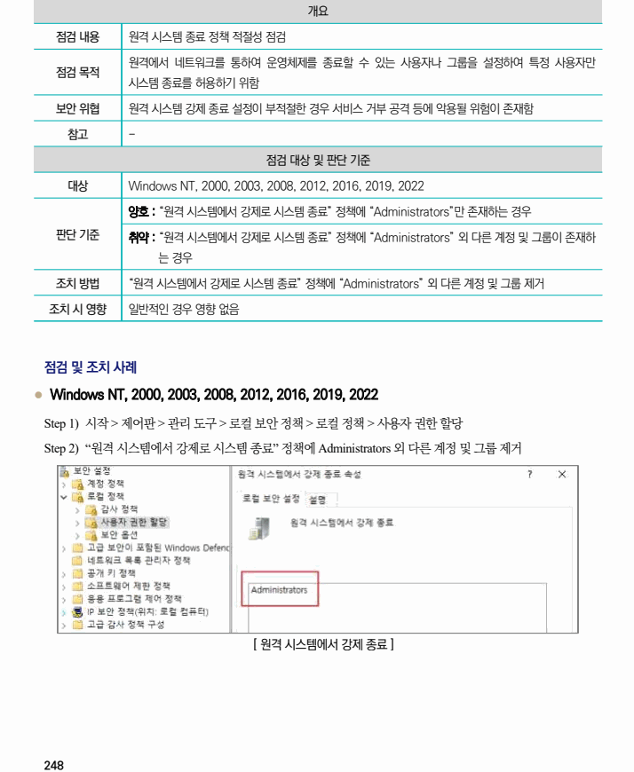

## 원문 전사

### PDF 페이지 248

~~~text transcription
개요
점검 내용 원격 시스템 종료 정책 적절성 점검
원격에서 네트워크를 통하여 운영체제를 종료할 수 있는 사용자나 그룹을 설정하여 특정 사용자만
점검 목적
시스템 종료를 허용하기 위함
보안 위협 원격 시스템 강제 종료 설정이 부적절한 경우 서비스 거부 공격 등에 악용될 위험이 존재함
참고 -
점검 대상 및 판단 기준
대상 Windows NT, 2000, 2003, 2008, 2012, 2016, 2019, 2022
양호 : “원격 시스템에서 강제로 시스템 종료” 정책에 “Administrators”만 존재하는 경우
판단 기준 취약 : “원격 시스템에서 강제로 시스템 종료” 정책에 “Administrators” 외 다른 계정 및 그룹이 존재하
는 경우
조치 방법 “원격 시스템에서 강제로 시스템 종료” 정책에 “Administrators” 외 다른 계정 및 그룹 제거
조치 시 영향 일반적인 경우 영향 없음
점검 및 조치 사례
l Windows NT, 2000, 2003, 2008, 2012, 2016, 2019, 2022
Step 1) 시작 > 제어판 > 관리 도구 > 로컬 보안 정책 > 로컬 정책 > 사용자 권한 할당
Step 2) “원격 시스템에서 강제로 시스템 종료” 정책에 Administrators 외 다른 계정 및 그룹 제거
[ 원격 시스템에서 강제 종료 ]
~~~

