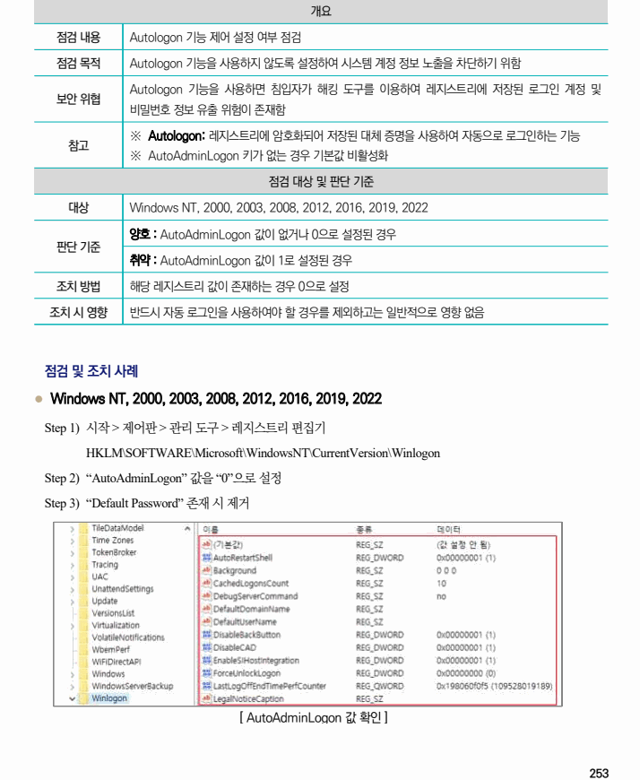

## 원문 전사

### PDF 페이지 253

~~~text transcription
개요
점검 내용 Autologon 기능 제어 설정 여부 점검
점검 목적 Autologon 기능을 사용하지 않도록 설정하여 시스템 계정 정보 노출을 차단하기 위함
Autologon 기능을 사용하면 침입자가 해킹 도구를 이용하여 레지스트리에 저장된 로그인 계정 및
보안 위협
비밀번호 정보 유출 위험이 존재함
※ Autologon: 레지스트리에 암호화되어 저장된 대체 증명을 사용하여 자동으로 로그인하는 기능
참고
※ AutoAdminLogon 키가 없는 경우 기본값 비활성화
점검 대상 및 판단 기준
대상 Windows NT, 2000, 2003, 2008, 2012, 2016, 2019, 2022
양호 : AutoAdminLogon 값이 없거나 0으로 설정된 경우
판단 기준
취약 : AutoAdminLogon 값이 1로 설정된 경우
조치 방법 해당 레지스트리 값이 존재하는 경우 0으로 설정
조치 시 영향 반드시 자동 로그인을 사용하여야 할 경우를 제외하고는 일반적으로 영향 없음
점검 및 조치 사례
l Windows NT, 2000, 2003, 2008, 2012, 2016, 2019, 2022
Step 1) 시작 > 제어판 > 관리 도구 > 레지스트리 편집기
HKLM\SOFTWARE\Microsoft\WindowsNT\CurrentVersion\Winlogon
Step 2) “AutoAdminLogon” 값을 “0”으로 설정
Step 3) “Default Password” 존재 시 제거
[ AutoAdminLogon 값 확인 ]
~~~

