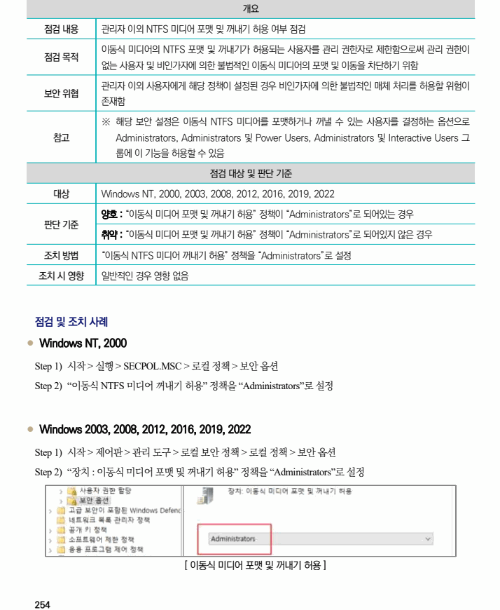

## 원문 전사

### PDF 페이지 254

~~~text transcription
개요
점검 내용 관리자 이외 NTFS 미디어 포맷 및 꺼내기 허용 여부 점검
이동식 미디어의 NTFS 포맷 및 꺼내기가 허용되는 사용자를 관리 권한자로 제한함으로써 관리 권한이
점검 목적
없는 사용자 및 비인가자에 의한 불법적인 이동식 미디어의 포맷 및 이동을 차단하기 위함
관리자 이외 사용자에게 해당 정책이 설정된 경우 비인가자에 의한 불법적인 매체 처리를 허용할 위험이
보안 위협
존재함
※ 해당 보안 설정은 이동식 NTFS 미디어를 포맷하거나 꺼낼 수 있는 사용자를 결정하는 옵션으로
참고 Administrators, Administrators 및 Power Users, Administrators 및 Interactive Users 그
룹에 이 기능을 허용할 수 있음
점검 대상 및 판단 기준
대상 Windows NT, 2000, 2003, 2008, 2012, 2016, 2019, 2022
양호 : “이동식 미디어 포맷 및 꺼내기 허용” 정책이 “Administrators”로 되어있는 경우
판단 기준
취약 : “이동식 미디어 포맷 및 꺼내기 허용” 정책이 “Administrators”로 되어있지 않은 경우
조치 방법 “이동식 NTFS 미디어 꺼내기 허용” 정책을 “Administrators”로 설정
조치 시 영향 일반적인 경우 영향 없음
점검 및 조치 사례
l Windows NT, 2000
Step 1) 시작 > 실행 > SECPOL.MSC > 로컬 정책 > 보안 옵션
Step 2) “이동식 NTFS 미디어 꺼내기 허용” 정책을 “Administrators”로 설정
l Windows 2003, 2008, 2012, 2016, 2019, 2022
Step 1) 시작 > 제어판 > 관리 도구 > 로컬 보안 정책 > 로컬 정책 > 보안 옵션
Step 2) “장치 : 이동식 미디어 포맷 및 꺼내기 허용” 정책을 “Administrators”로 설정
[ 이동식 미디어 포맷 및 꺼내기 허용 ]
~~~

