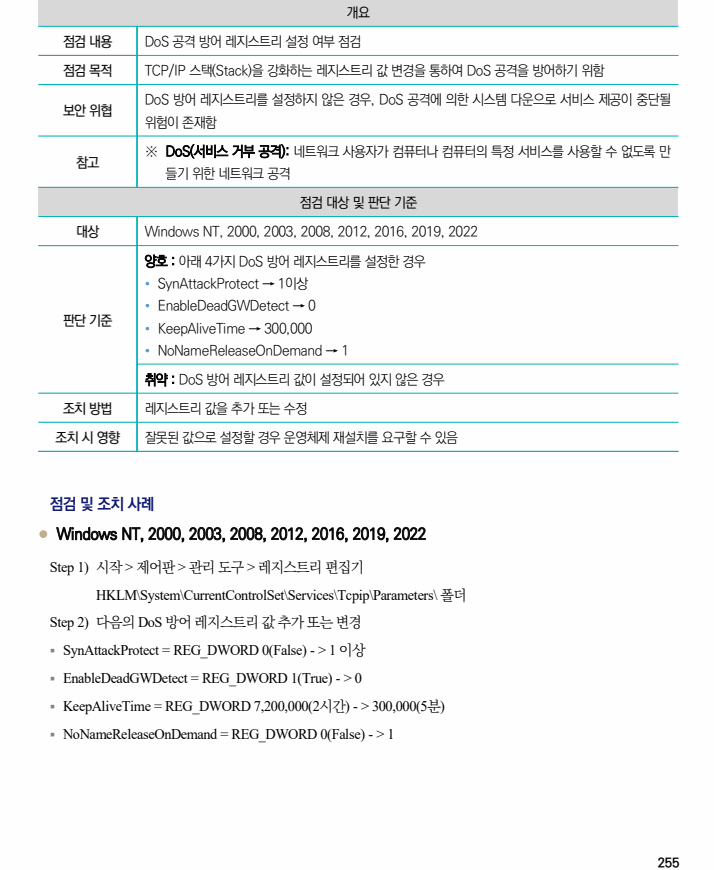

## 원문 전사

### PDF 페이지 255

~~~text transcription
개요
점검 내용 DoS 공격 방어 레지스트리 설정 여부 점검
점검 목적 TCP/IP 스택(Stack)을 강화하는 레지스트리 값 변경을 통하여 DoS 공격을 방어하기 위함
DoS 방어 레지스트리를 설정하지 않은 경우, DoS 공격에 의한 시스템 다운으로 서비스 제공이 중단될
보안 위협
위험이 존재함
※ DoS(서비스 거부 공격): 네트워크 사용자가 컴퓨터나 컴퓨터의 특정 서비스를 사용할 수 없도록 만
참고
들기 위한 네트워크 공격
점검 대상 및 판단 기준
대상 Windows NT, 2000, 2003, 2008, 2012, 2016, 2019, 2022
양호 : 아래 4가지 DoS 방어 레지스트리를 설정한 경우
Ÿ SynAttackProtect → 1이상
Ÿ EnableDeadGWDetect → 0
판단 기준
Ÿ KeepAliveTime → 300,000
Ÿ NoNameReleaseOnDemand → 1
취약 : DoS 방어 레지스트리 값이 설정되어 있지 않은 경우
조치 방법 레지스트리 값을 추가 또는 수정
조치 시 영향 잘못된 값으로 설정할 경우 운영체제 재설치를 요구할 수 있음
점검 및 조치 사례
l Windows NT, 2000, 2003, 2008, 2012, 2016, 2019, 2022
Step 1) 시작 > 제어판 > 관리 도구 > 레지스트리 편집기
HKLM\System\CurrentControlSet\Services\Tcpip\Parameters\ 폴더
Step 2) 다음의 DoS 방어 레지스트리 값 추가 또는 변경
§ SynAttackProtect = REG_DWORD 0(False) - > 1 이상
§ EnableDeadGWDetect = REG_DWORD 1(True) - > 0
§ KeepAliveTime = REG_DWORD 7,200,000(2시간) - > 300,000(5분)
§ NoNameReleaseOnDemand = REG_DWORD 0(False) - > 1
~~~

