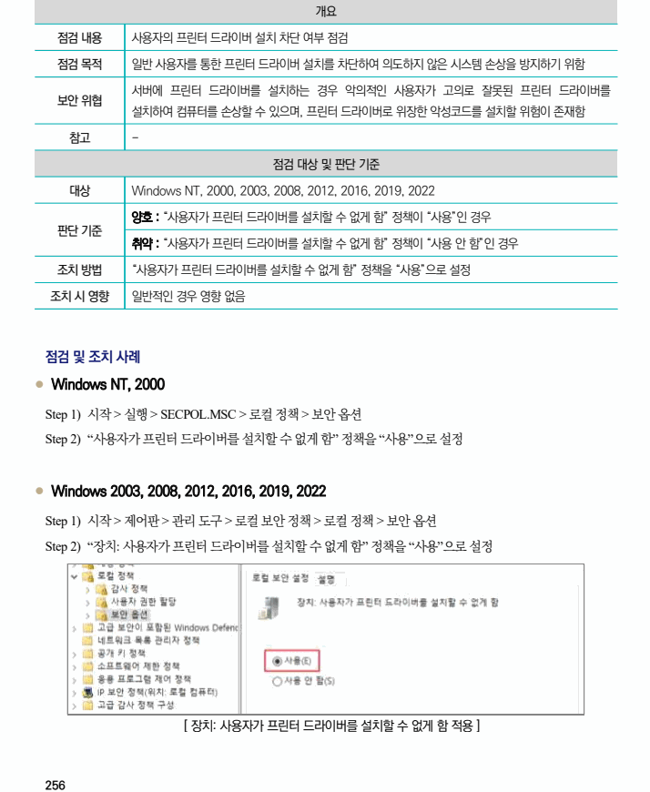

## 원문 전사

### PDF 페이지 256

~~~text transcription
개요
점검 내용 사용자의 프린터 드라이버 설치 차단 여부 점검
점검 목적 일반 사용자를 통한 프린터 드라이버 설치를 차단하여 의도하지 않은 시스템 손상을 방지하기 위함
서버에 프린터 드라이버를 설치하는 경우 악의적인 사용자가 고의로 잘못된 프린터 드라이버를
보안 위협
설치하여 컴퓨터를 손상할 수 있으며, 프린터 드라이버로 위장한 악성코드를 설치할 위험이 존재함
참고 -
점검 대상 및 판단 기준
대상 Windows NT, 2000, 2003, 2008, 2012, 2016, 2019, 2022
양호 : “사용자가 프린터 드라이버를 설치할 수 없게 함” 정책이 “사용”인 경우
판단 기준
취약 : “사용자가 프린터 드라이버를 설치할 수 없게 함” 정책이 “사용 안 함”인 경우
조치 방법 “사용자가 프린터 드라이버를 설치할 수 없게 함” 정책을 “사용”으로 설정
조치 시 영향 일반적인 경우 영향 없음
점검 및 조치 사례
l Windows NT, 2000
Step 1) 시작 > 실행 > SECPOL.MSC > 로컬 정책 > 보안 옵션
Step 2) “사용자가 프린터 드라이버를 설치할 수 없게 함” 정책을 “사용”으로 설정
l Windows 2003, 2008, 2012, 2016, 2019, 2022
Step 1) 시작 > 제어판 > 관리 도구 > 로컬 보안 정책 > 로컬 정책 > 보안 옵션
Step 2) “장치: 사용자가 프린터 드라이버를 설치할 수 없게 함” 정책을 “사용”으로 설정
[ 장치: 사용자가 프린터 드라이버를 설치할 수 없게 함 적용 ]
~~~

