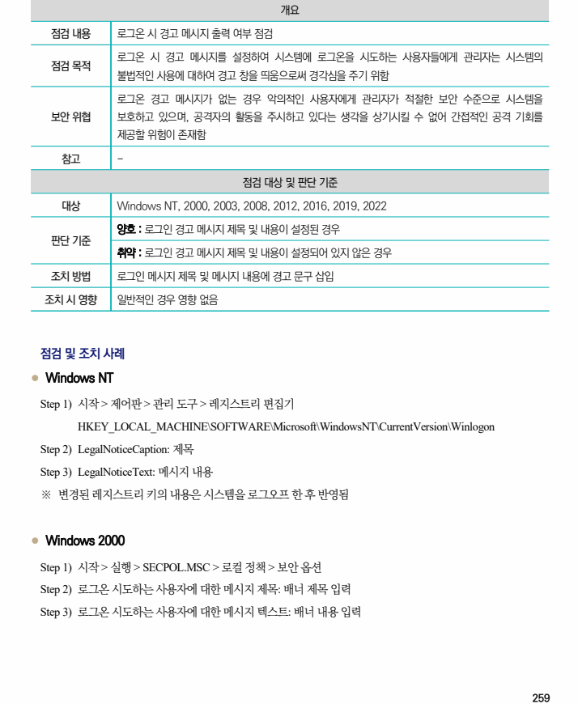
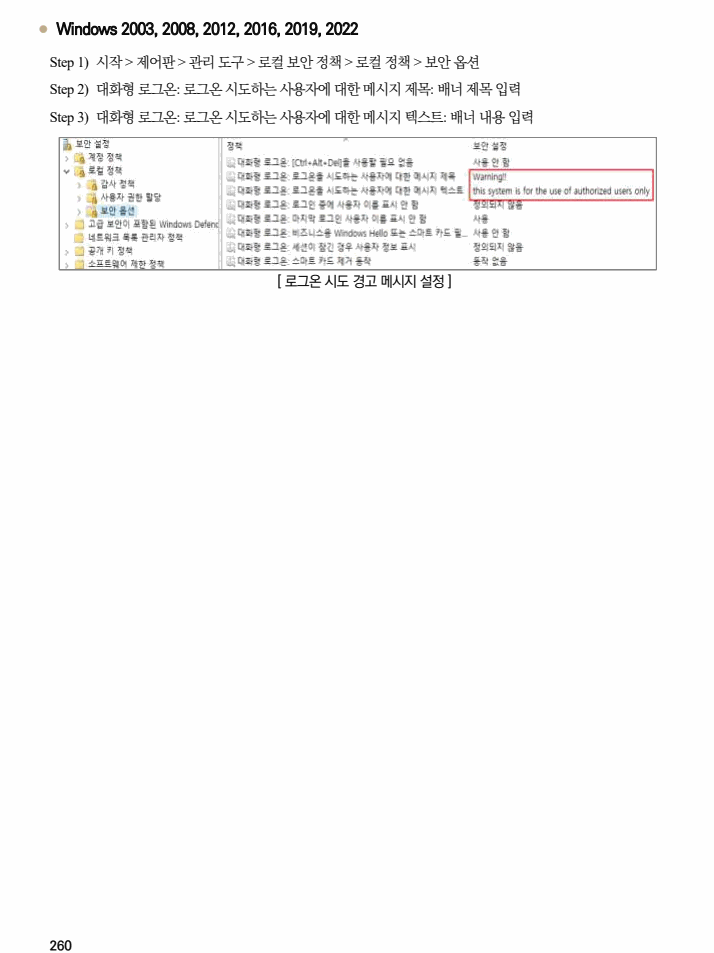

## 원문 전사

### PDF 페이지 259

~~~text transcription
개요
점검 내용 로그온 시 경고 메시지 출력 여부 점검
로그온 시 경고 메시지를 설정하여 시스템에 로그온을 시도하는 사용자들에게 관리자는 시스템의
점검 목적
불법적인 사용에 대하여 경고 창을 띄움으로써 경각심을 주기 위함
로그온 경고 메시지가 없는 경우 악의적인 사용자에게 관리자가 적절한 보안 수준으로 시스템을
보안 위협 보호하고 있으며, 공격자의 활동을 주시하고 있다는 생각을 상기시킬 수 없어 간접적인 공격 기회를
제공할 위험이 존재함
참고 -
점검 대상 및 판단 기준
대상 Windows NT, 2000, 2003, 2008, 2012, 2016, 2019, 2022
양호 : 로그인 경고 메시지 제목 및 내용이 설정된 경우
판단 기준
취약 : 로그인 경고 메시지 제목 및 내용이 설정되어 있지 않은 경우
조치 방법 로그인 메시지 제목 및 메시지 내용에 경고 문구 삽입
조치 시 영향 일반적인 경우 영향 없음
점검 및 조치 사례
l Windows NT
Step 1) 시작 > 제어판 > 관리 도구 > 레지스트리 편집기
HKEY_LOCAL_MACHINE\SOFTWARE\Microsoft\WindowsNT\CurrentVersion\Winlogon
Step 2) LegalNoticeCaption: 제목
Step 3) LegalNoticeText: 메시지 내용
※ 변경된 레지스트리 키의 내용은 시스템을 로그오프 한 후 반영됨
l Windows 2000
Step 1) 시작 > 실행 > SECPOL.MSC > 로컬 정책 > 보안 옵션
Step 2) 로그온 시도하는 사용자에 대한 메시지 제목: 배너 제목 입력
Step 3) 로그온 시도하는 사용자에 대한 메시지 텍스트: 배너 내용 입력
~~~

### PDF 페이지 260

~~~text transcription
l Windows 2003, 2008, 2012, 2016, 2019, 2022
Step 1) 시작 > 제어판 > 관리 도구 > 로컬 보안 정책 > 로컬 정책 > 보안 옵션
Step 2) 대화형 로그온: 로그온 시도하는 사용자에 대한 메시지 제목: 배너 제목 입력
Step 3) 대화형 로그온: 로그온 시도하는 사용자에 대한 메시지 텍스트: 배너 내용 입력
[ 로그온 시도 경고 메시지 설정 ]
~~~

