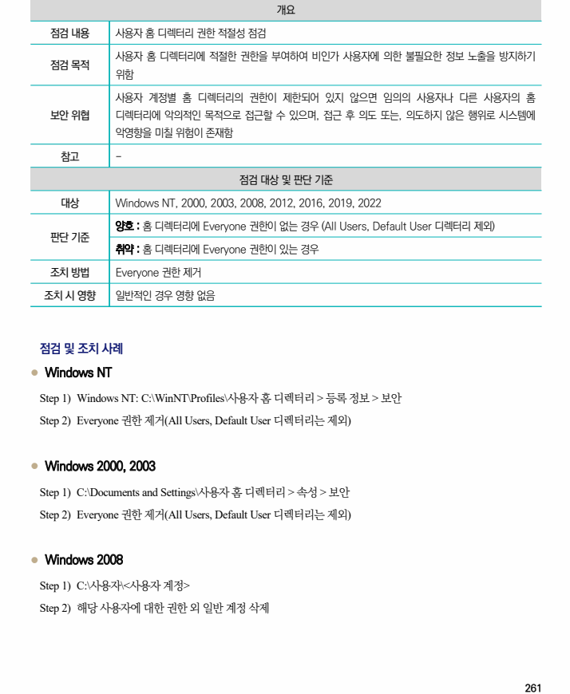
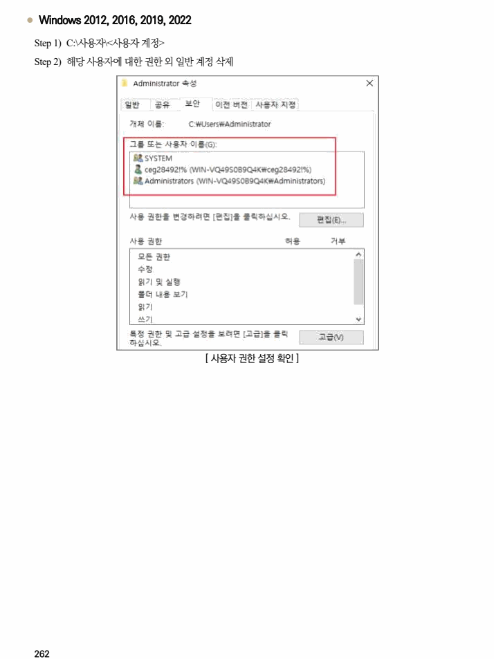

## 원문 전사

### PDF 페이지 261

~~~text transcription
개요
점검 내용 사용자 홈 디렉터리 권한 적절성 점검
사용자 홈 디렉터리에 적절한 권한을 부여하여 비인가 사용자에 의한 불필요한 정보 노출을 방지하기
점검 목적
위함
사용자 계정별 홈 디렉터리의 권한이 제한되어 있지 않으면 임의의 사용자나 다른 사용자의 홈
보안 위협 디렉터리에 악의적인 목적으로 접근할 수 있으며, 접근 후 의도 또는, 의도하지 않은 행위로 시스템에
악영향을 미칠 위험이 존재함
참고 -
점검 대상 및 판단 기준
대상 Windows NT, 2000, 2003, 2008, 2012, 2016, 2019, 2022
양호 : 홈 디렉터리에 Everyone 권한이 없는 경우 (All Users, Default User 디렉터리 제외)
판단 기준
취약 : 홈 디렉터리에 Everyone 권한이 있는 경우
조치 방법 Everyone 권한 제거
조치 시 영향 일반적인 경우 영향 없음
점검 및 조치 사례
l Windows NT
Step 1) Windows NT: C:\WinNT\Profiles\사용자 홈 디렉터리 > 등록 정보 > 보안
Step 2) Everyone 권한 제거(All Users, Default User 디렉터리는 제외)
l Windows 2000, 2003
Step 1) C:\Documents and Settings\사용자 홈 디렉터리 > 속성 > 보안
Step 2) Everyone 권한 제거(All Users, Default User 디렉터리는 제외)
l Windows 2008
Step 1) C:\사용자\<사용자 계정>
Step 2) 해당 사용자에 대한 권한 외 일반 계정 삭제
~~~

### PDF 페이지 262

~~~text transcription
l Windows 2012, 2016, 2019, 2022
Step 1) C:\사용자\<사용자 계정>
Step 2) 해당 사용자에 대한 권한 외 일반 계정 삭제
[ 사용자 권한 설정 확인 ]
~~~

