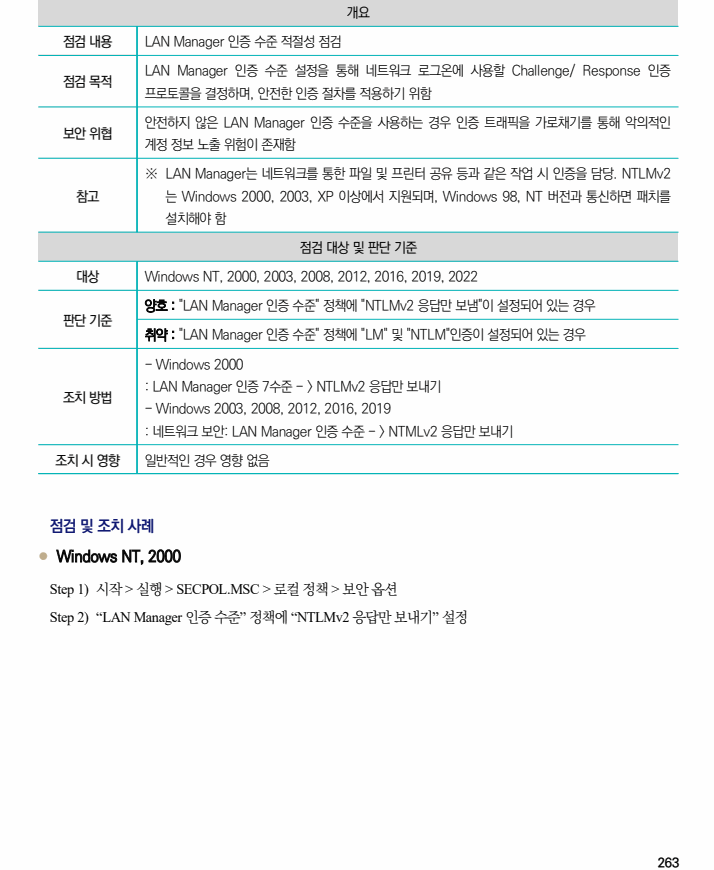
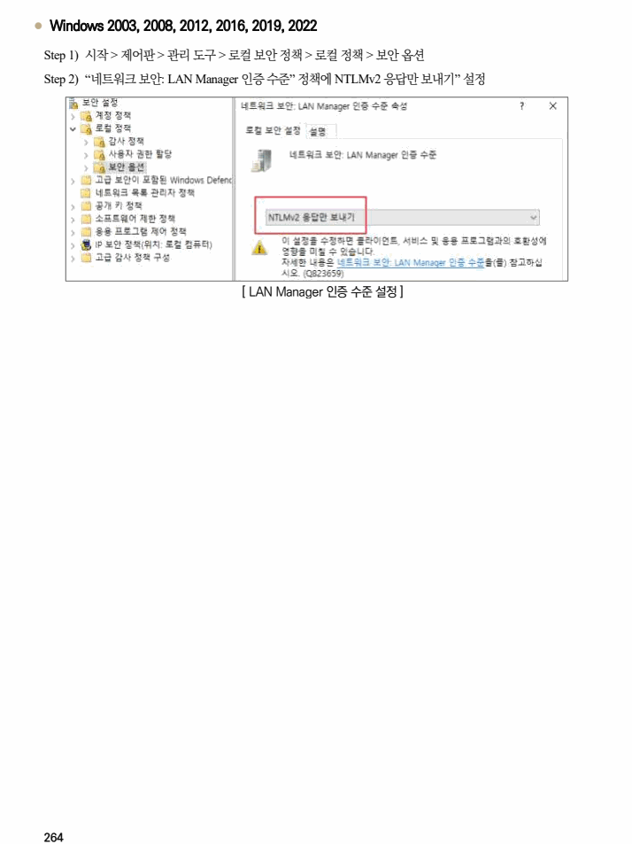

## 원문 전사

### PDF 페이지 263

~~~text transcription
개요
점검 내용 LAN Manager 인증 수준 적절성 점검
LAN Manager 인증 수준 설정을 통해 네트워크 로그온에 사용할 Challenge/ Response 인증
점검 목적
프로토콜을 결정하며, 안전한 인증 절차를 적용하기 위함
안전하지 않은 LAN Manager 인증 수준을 사용하는 경우 인증 트래픽을 가로채기를 통해 악의적인
보안 위협
계정 정보 노출 위험이 존재함
※ LAN Manager는 네트워크를 통한 파일 및 프린터 공유 등과 같은 작업 시 인증을 담당. NTLMv2
참고 는 Windows 2000, 2003, XP 이상에서 지원되며, Windows 98, NT 버전과 통신하면 패치를
설치해야 함
점검 대상 및 판단 기준
대상 Windows NT, 2000, 2003, 2008, 2012, 2016, 2019, 2022
양호 : "LAN Manager 인증 수준" 정책에 "NTLMv2 응답만 보냄"이 설정되어 있는 경우
판단 기준
취약 : "LAN Manager 인증 수준" 정책에 "LM" 및 "NTLM"인증이 설정되어 있는 경우
- Windows 2000
: LAN Manager 인증 7수준 - > NTLMv2 응답만 보내기
조치 방법
- Windows 2003, 2008, 2012, 2016, 2019
: 네트워크 보안: LAN Manager 인증 수준 - > NTMLv2 응답만 보내기
조치 시 영향 일반적인 경우 영향 없음
점검 및 조치 사례
l Windows NT, 2000
Step 1) 시작 > 실행 > SECPOL.MSC > 로컬 정책 > 보안 옵션
Step 2) “LAN Manager 인증 수준” 정책에 “NTLMv2 응답만 보내기” 설정
~~~

### PDF 페이지 264

~~~text transcription
l Windows 2003, 2008, 2012, 2016, 2019, 2022
Step 1) 시작 > 제어판 > 관리 도구 > 로컬 보안 정책 > 로컬 정책 > 보안 옵션
Step 2) “네트워크 보안: LAN Manager 인증 수준” 정책에 NTLMv2 응답만 보내기” 설정
[ LAN Manager 인증 수준 설정 ]
~~~

