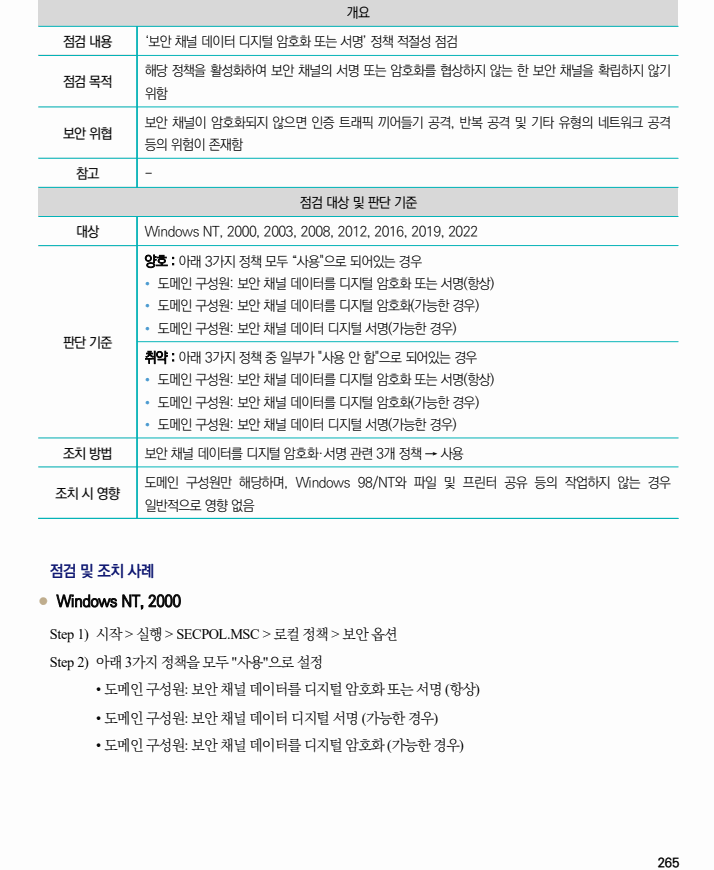
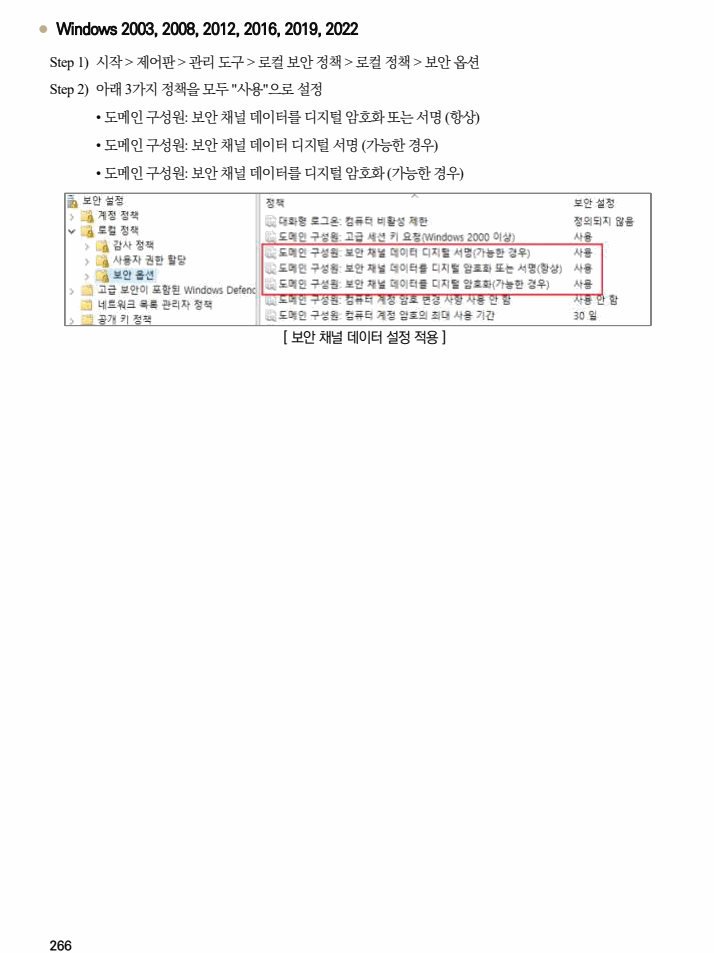

## 원문 전사

### PDF 페이지 265

~~~text transcription
개요
점검 내용 ‘보안 채널 데이터 디지털 암호화 또는 서명’ 정책 적절성 점검
해당 정책을 활성화하여 보안 채널의 서명 또는 암호화를 협상하지 않는 한 보안 채널을 확립하지 않기
점검 목적
위함
보안 채널이 암호화되지 않으면 인증 트래픽 끼어들기 공격, 반복 공격 및 기타 유형의 네트워크 공격
보안 위협
등의 위험이 존재함
참고 -
점검 대상 및 판단 기준
대상 Windows NT, 2000, 2003, 2008, 2012, 2016, 2019, 2022
양호 : 아래 3가지 정책 모두 “사용"으로 되어있는 경우
Ÿ 도메인 구성원: 보안 채널 데이터를 디지털 암호화 또는 서명(항상)
Ÿ 도메인 구성원: 보안 채널 데이터를 디지털 암호화(가능한 경우)
Ÿ 도메인 구성원: 보안 채널 데이터 디지털 서명(가능한 경우)
판단 기준
취약 : 아래 3가지 정책 중 일부가 "사용 안 함"으로 되어있는 경우
Ÿ 도메인 구성원: 보안 채널 데이터를 디지털 암호화 또는 서명(항상)
Ÿ 도메인 구성원: 보안 채널 데이터를 디지털 암호화(가능한 경우)
Ÿ 도메인 구성원: 보안 채널 데이터 디지털 서명(가능한 경우)
조치 방법 보안 채널 데이터를 디지털 암호화·서명 관련 3개 정책 → 사용
도메인 구성원만 해당하며, Windows 98/NT와 파일 및 프린터 공유 등의 작업하지 않는 경우
조치 시 영향
일반적으로 영향 없음
점검 및 조치 사례
l Windows NT, 2000
Step 1) 시작 > 실행 > SECPOL.MSC > 로컬 정책 > 보안 옵션
Step 2) 아래 3가지 정책을 모두 "사용"으로 설정
• 도메인 구성원: 보안 채널 데이터를 디지털 암호화 또는 서명 (항상)
• 도메인 구성원: 보안 채널 데이터 디지털 서명 (가능한 경우)
• 도메인 구성원: 보안 채널 데이터를 디지털 암호화 (가능한 경우)
~~~

### PDF 페이지 266

~~~text transcription
l Windows 2003, 2008, 2012, 2016, 2019, 2022
Step 1) 시작 > 제어판 > 관리 도구 > 로컬 보안 정책 > 로컬 정책 > 보안 옵션
Step 2) 아래 3가지 정책을 모두 "사용"으로 설정
• 도메인 구성원: 보안 채널 데이터를 디지털 암호화 또는 서명 (항상)
• 도메인 구성원: 보안 채널 데이터 디지털 서명 (가능한 경우)
• 도메인 구성원: 보안 채널 데이터를 디지털 암호화 (가능한 경우)
[ 보안 채널 데이터 설정 적용 ]
~~~

